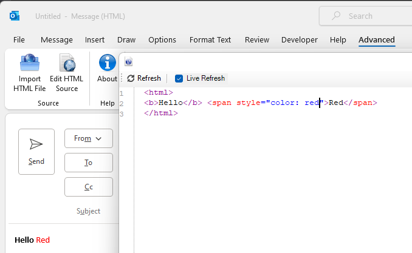

# Outlook Extension for HTML Editing

This is extension for the easier HTML editing of the emails for the Outlook.
Outlook HTML is pretty restricted and thus creation of nice looking emails can be pretty time consuming process, especially if constantly send emails just to check if HTML looks right. So, with this extension it's possible to see your email in live as you type HTML markup.

# Installation instructions

1. Get the latest release: https://github.com/jarig/outlookhtmleditor/releases
1. Place `HTMLEditorForOutlook.vsto` to some location where it will be safe and run it, this will the extension. If you delete this file, then extension will disappear, as Outlook loads it on startup from there.
1. Start creation of new email, select `Advanced` section and click `Edit HTML Source`, tick `Live Refresh` if you want to see results as you type.

